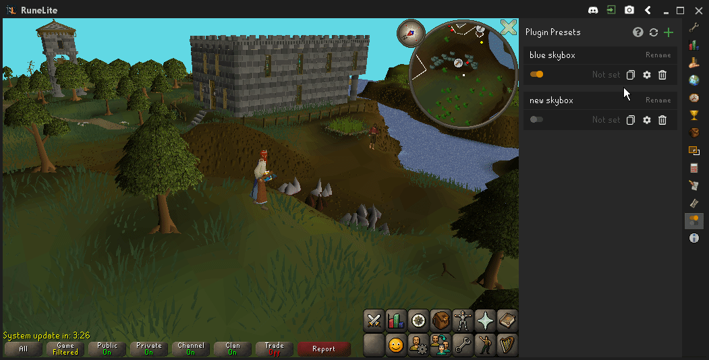
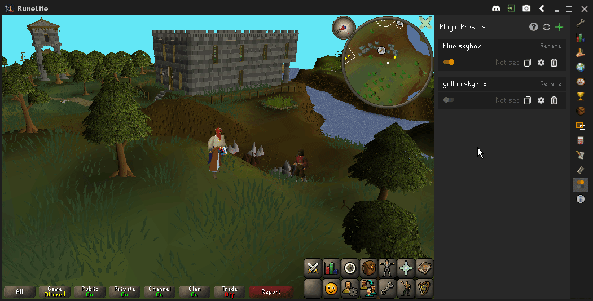

# RuneLite Plugin Presets plugin 

This plugin adds the ability to create presets from your RuneLite plugin configurations.

## Using Plugin Presets

Download the Plugin Presets plugin from the RuneLite Plugin Hub and enable it.

Click the green + sign to create a new empty _plugin preset_. Plugin Preset are text files that are stored in your presets folder at `~/.runelite/presets/` or alternatively in your RuneLite configurations in `~/.runelite/settings.properties` file and they store any configurations that you can edit from the RuneLite configuration sidepanel.

The orange switch indicates whether or not the presets saved configurations **match** your current configurations. Loading a preset will copy all of those setting in the preset file to your current runelite configurations as if you manually changed all of your plugin configurations to match the presets ones. If the switch is off, it means that some of your configurations don't match the presets configurations.

The cog icon in the preset panel opens the preset editor. In the editor view you can view, add, update and remove plugin configurations from your plugin presets. The checkboxes visualize whether or not the preset has stored any configurations to a certain plugin. If the checkbox is checked, that preset has stored some configurations and loading it will enable those configurations for you.

When the presets and your configurations differ, the edit panel will display a **modified** icon next to the checkbox. This means that the preset has stored different configuration to the plugin that you currently have enabled. One case would be that the preset has stored a nice yellow sunset color for the Skybox plugin, but after creating that preset, you have changed your skybox color to a blue daylight. In that case, left of the checkbox, a modified icon would be visible. Clicking the modified icon will **Update the presets configuration with your current configuration**, which means that after clicking it, the preset would now store your blue daylight color instead of the yellow sunset.

The modification icon does not mean that you need to allways update that configuration since the reason to use this plugin is to have the ability to change between different configurations easily. For example you could have 2 presets that store different color configurations to the skybox plugin and when enabling one of the presets, naturally the other preset will display a modified icon since, from the other presets perspective, the configurations have changed since creation.  

Presets can be bound to custom keybinds by clicking the _Not set_ text. After cliking, type a key combination and it should be show on the panel. Once you are happy with the keybind, click save or press enter. Now the preset gets loaded after you press the keybind in game. Note that other plugins also have keybinds and those may or may not override your preset keybind, so prefer not to use duplicate keybindings.

> Single keybind only enables one preset so if you want to enable multiple presets with one keybind, consider creating a single preset containing the configurations from the presets you wish to enable.

Your plugin presets can become fairly messy after a while or cause problems if changing a lot of configurations between preset creations. To avoid confusion and problems, name your presets well, keep your presets up to date. Prefer to have presets **only contain the configurations you wish to change**, this also increases performance and reduces the strain to keep your presets up to date.

### Sharing plugin presets

Your presets are stored in the `~/.runelite/presets/` folder or alternative in the `settings.properties` configuration file. In the preset editor view you can toggle where the plugin is stored by clicking the file/cloud icon.

You can share these _.json_ files with others, they don't contain information about your account, Discord or Twitch. Alternatively you can click the copy icon in the preset panel to copy the presets data to your clipboard for easier sharing e.g. through Discord, Pastebin etc...

To "install" new presets, paste the .json file to the preset folder and then press the "refresh presets" button. Alternatively you can right-click the green + sign to import presets from clipboard. You can easily access your preset folder by right-clicking the Plugin Preset icon in the RuneLite sidebar.

Note that external presets might contain configurations different to yours, so when enabling presets from others, they might have changed e.g. keybinds that you might have set up differently. In the edit panel, you can view the plugins that the preset has some configurations. Alternatively you can view the raw [json](https://en.wikipedia.org/wiki/JSON) by copying it and pasting it to a [json viewer](http://jsonviewer.stack.hu/). **When sending presets to others, make sure to always double check for sensetive information!**

## Issues

If you've experienced an issue with Plugin Presets, or have a recommendation on how to improve it, please [create an issue](https://github.com/antero111/plugin-presets/issues/new) or [start a discussion](https://github.com/antero111/plugin-presets/discussion/new) with the relevant details.

### License

See [LICENSE](LICENSE).

### Changelog

See [CHANGELOG.md](CHANGELOG.md).
