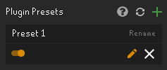

# RuneLite Plugin Presets plugin

This plugin adds the ability to create presets of your RuneLite plugin configurations.

## Using Plugin Presets

Firstly, download the Plugin Presets plugin from the RuneLite Plugin Hub and enable it.

Click the green + sign to create a new _plugin preset_ from your current plugin configurations. Name your new preset and your current plugin settings are saved to that preset.

_Plugin presets_ are "copies" of your current plugin configurations from the moment of creating or modifying a preset. Creating a new preset means that Plugin Presets saves a copy of your current plugin configurations. So to make new presets, simply modify your RuneLite plugin configurations as usual and create a new preset.

To load a preset, simply click the "load preset" button to enable configurations from that preset. **If you have "unsaved" configurations when loading to a different preset, those configurations are lost**.

Modifying presets happen by updating (overwriting) its configurations by pressing the pen icon.

When downloading external plugins from the Plugin Hub, new plugins won't be added to your existing presets. To fix this, simply update your presets with the new plugin loaded. Plugin Presets will notify you when you have plugins that are not saved to a certain preset with an orange pen icon.

Note that Plugin Presets does not check if you have already saved your RuneLite configurations to a preset. To stay organized, name your presets well and delete unnecessary duplicate configurations.

  
How to revert back to default RuneLite settings

    If you need to revert back to default RuneLite settings, delete the <code>settings.properties</code> file from <code>~/.runelite/</code> and reload your client. This does not affect any of your presets but your current plugin configurations will be set to default values. (This works for all plugins, not a Plugin Presets feature.)

## Sharing plugin presets

Your presets are stored in `~/.runelite/presets/`. You can share these .json files with others, they don't contain information about your account, RuneLite notes, Discord or Twitch. **When sending presets to others, make sure to always double check for sensetive information!**

To "install" new presets, simply copy the .json file to the preset folder and then press the "refresh plugins" button. You can easily access your preset folder by right-clicking the Plugin Preset icon in the RuneLite sidebar.

Note that these presets contains _all_ of your plugin configurations, so when installing presets from others, they might have changed eg. keybinds that you might have set up differently. Make sure to always keep backups of your configurations when trying to install presets from others.

Presets from others might have settings to plugins installed from the Plugin Hub. Plugin Presets will notify you when you have "uninstalled" plugins with a red warning sign.  

If you don't want to install external plugins, enable the preset and update (overwrite) it with your new settings. This will discard the external plugin settings from the preset.

## Issues

If you've experienced an issue with Plugin Presets, or have a recommendation on how to improve it, please [create an issue](https://github.com/antero111/plugin-presets/issues/new) with the relevant details.

## Changelog

### 1.2

Added

- "Unsaved" external plugin notification
- Uninstalled external plugin notification  
- Plugin icon

Changed

- "Overwrite" to "update"

### 1.1

Added

- Ability to unload a preset

Fixed

- Unsaved Plugin Hub plugin handling

### 1.0

- Plugin added
